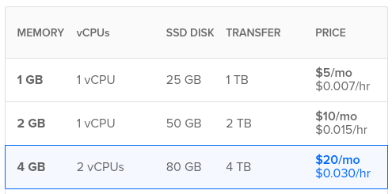
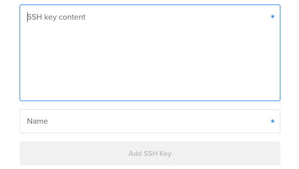

# Full Node VPS Setup

```post-author
Alex Sherbuck
```

```post-description
This guide provides installation instructions for a Bcoin full node running on a Digital Ocean of Amazon AWS Virtual Private Server.
```


* [Introduction](#introduction)
* [Digital Ocean](#digital-ocean)
* [Amazon AWS](#amazon-aws)
* [Connecting to your server](#connecting-to-your-server)
* [Setting up the environment](#setting-up-the-environment)
* [Create a New User](#create-a-new-user)
* [Install Bcoin](#install-bcoin)


## Introduction

Running a full node requires your computer always be online and connected to the Bitcoin network. For most users, a VPS is an elegant 24/7 full node solution.

## Digital Ocean

### Create an account @digitalocean.com
### Choose 'Create' -> 'Droplet' from the account dashboard


### Choose 'Ubuntu 16.04' for OS Distribution


### Choose '4 GB 2 CPU $20/month' for Droplet Size

### Add Block Storage, 500GB $50/month.

### Choose a data center region.


##### A Note on hardware requirements
These hardware requirements are for a full node. When run in SPV mode, you will not need the additional block storage. To run a full node you must maintain a complete history of all Bitcoin transactions. Without the full history the node is unable to validate transactions. If it cannot validate transactions, it cannot validate blocks or mine transactions to blocks.

SPV Nodes use something called a bloom filter to maintain a smaller set of records. For example, if your Bitcoin address were `1A1zP1eP5QGefi2DMPTfTL5SLmv7DivfNa` your SPV node will ask its network peers for all transactions with an address that starts with `1A1z`. The returned data set will contain extra transactions irrelevant to your wallet. But its storage requirements will be far smaller than a full node. Consequently, SPV Nodes can only verify their own transactions.

More information on SPV Nodes:
+ [Bitcoin Whitepaper - Section 8](https://bitcoin.org/bitcoin.pdf)
+ [Bitcoin.org Developer Guide](https://bitcoin.org/en/developer-guide#simplified-payment-verification-spv)
+ [BIP37](https://github.com/bitcoin/bips/blob/master/bip-0037.mediawiki)

### Add a new ssh key


### Setting Up SSH
If you already have an ssh key you can copy your pubkey here. If you do not then follow these steps:

```
ssh-keygen -t rsa -C "your_email@example.com"
```

Accept the defaults.

On Windows your keys are located:

```
%userprofile%/.ssh
```

On Linux/Mac:

```
cd ~/.ssh
```

Copy the contents of the `id_rsa.pub` file and paste them into Digital Ocean's form.

```
ssh-rsa AAAAB3NzaC1yc2EAAAADAQABAAABAQCsYKEA5LZCDyMF+ZbrPWeVIYso0ZzpIZx9L7R+CGqMPo0mrSlYeeaPbP1btM/Wis4a81EaTM7Y5kkKqZ4XB/LnRWp415XVl5QdtGF2l5tgiy2ootVxEwdrH0lXyGFHEpOwHU6MYdYCd+bgpQwa291Q4bOUJhGxNZ07L/rMtZfWhWL
+YL+JpSajg/uonu+4YKuFETggGLIuK+piTD9dvjiaThwKtqiCh2dnqdHztRYk+OehJUcof3tFl9kSRUmh9MVI7pDaOxCJWRaU1dsn9YaUwRkIyOwESHqBdCE9ZDU4FzNItRh2dYY4ukGv2iRqZoTrjcB8UGJepI65aINKNvdj email@nomail.com
```

8. Choose a hostname for the droplet and click create.

Digital Ocean will provision your server. Now is a good time to grab coffee.


## Amazon AWS

### Create an account
[AWS](https://aws.amazon.com)

### Launch a new instance from the console
[Console](https://aws.amazon.com/console)


### Choose 'Ubuntu 16.04' and at least 2CPU 4GiB for hardware

### Continue to add storage. Add 500GiB

### Review and Launch
### Amazon will prompt you for an ssh keypair, download a new keypair


Treat this keyfile with the same respect you treat your Bitcoin wallet file. Both are private keys and you will be the only person with a copy of your keyfile. If you lose it, Amazon will not be able to recovery it for you.

### Accept Acknowledgement & Launch Instances
### View Instances


[A Note on Hardware Requirements](#a-note-on-hardware-requirements)

Amazon will provision your server. Now is a good time to grab coffee.


## Connecting to your server

#### Digital Ocean

```
ssh username@Your.Server.Ip.Here
```

E.g.

```
ssh username@178.62.124.90
```

On a Linux/Mac if you don't provide a username it will use the currently logged in user. If you setup ssh keys you will not need to provide a username or password. You can also edit `/etc/hosts` to add a line like so:

```
178.62.124.90    fullnode
```

And then you can use:

```
$ ssh fullnode
```

to login without a username, password or having to remember the server ip.

Accept the RSA key, and you will be at the command line


#### Amazon

In the same directory as the private key you downloaded,

``` bash
chmod 400 test.pem
ssh -i "test.pem" yourname@yourinstance.amazonaws.com
```

E.g.

```
ssh -i "test.pem" ubuntu@ec2-18-219-26-103.us-east-2.compute.amazonaws.com
```

Accept the RSA key, and you will be at the command line

```
ubuntu@ip-172-31-7-194:~$
```

## Setting up the environment
The VPS is setup, from here the intructions will be the same regardless of VPS provider.

1. Install NVM
2. Install Node
4. Install build essential
5. Install python

```
$ curl -o- https://raw.githubusercontent.com/creationix/nvm/v0.33.8/install.sh | bash
$ source ~/.bashrc
$ nvm install 9.2.1
$ sudo apt-get install build-essential python
```
## Create a New User
It's not ideal to run as the root user. While logged in as root:
```
$ addduser test
root@igave:~# adduser test
Adding user `test' ...
Adding new group `test' (1002) ...
Adding new user `test' (1001) with group `test' ...
Creating home directory `/home/test' ...
Copying files from `/etc/skel' ...
New password:
BAD PASSWORD: it does not contain enough DIFFERENT characters
New password:
Retype new password:
passwd: password updated successfully
Changing the user information for test
Enter the new value, or press ENTER for the default
	Full Name []:
	Room Number []:
	Work Phone []:
	Home Phone []:
	Other []:
Is the information correct? [Y/n]
```

Sometimes you'll need root access. It's best to manage that with `visudo`

```
$ apt-get install visudo
```
And make the following addition, where `test` is the new user name:
```
test   ALL=(ALL:ALL) ALL
```

Then remove the `#` in front of `%admin` and `sudo` and add the groups to the new user
```
$ usermod -aG admin test
$ usermod -aG sudo test
```

Now to login to the server you will need to tell SSH to use this username. For Linux/Mac this is automatic if your system username is the same as the username you create.

```
$ ssh test@fullnode
```

Once logged in, you can preface commands with `sudo` to run them as the root user or change into the root user

```
$ sudo apt-get install htop
$ sudo su -
```

## Install Bcoin

Depending on your server's default software package, you may also need to [install `git`](https://git-scm.com/book/en/v2/Getting-Started-Installing-Git).


```
$ git clone https://github.com/bcoin-org/bcoin
$ cd bcoin
$ npm install -g
```

### Command Line Interaction
After bcoin installs we're going to store some configuration info and sensitive daat as environmental variables.

```
$ export BCOIN_API_KEY=hunter2
$ export BCOIN_NETWORK=main
$ export BCOIN_URI=http://localhost:8332
$ bcoin --index-tx --index-address --daemon
${PID}
```

Alternatively, you can assign http port and network using command line flags:

```
$ bcoin --index-tx --index-address --http-port=8332 --network=main
```

Here, PID is the process ID of bcoin. To stop bcoin you can issue `kill ${PID}` replacing `${PID}` with the number your terminal returns. If you forget the PID you can find it again with `ps -ef | grep bcoin`

You can use the bclient CLI tool out of the box. To view your node's status. First install it with:

```
npm install -g bclient
```

Then use it to query your node

```
$ bclient info --api-key=hunter2
{
  "version": "v1.0.0-beta.14",
  "network": "main",
  "chain": {
    "height": 124767,
    "tip": "0000000000003ae2272bb2ad89d11b3b3119536690de1bf3b3180d3e0df91d27",
    "progress": 0.2604341435491337
  },
  "pool": {
    "host": "2601:c6:c880:3020:1a5e:fff:febd:ff6",
    "port": 8333,
    "agent": "/bcoin:v1.0.0-beta.14/",
    "services": "1001",
    "outbound": 8,
    "inbound": 0
  },
  "mempool": {
    "tx": 0,
    "size": 0
  },
  "time": {
    "uptime": 450,
    "system": 1517778800,
    "adjusted": 1517778907,
    "offset": 107
  },
  "memory": {
    "total": 202,
    "jsHeap": 35,
    "jsHeapTotal": 70,
    "nativeHeap": 131,
    "external": 8
  }
}

```

For a complete list of CLI commands, check the [API documentation](https://bcoin.io/api-docs/index.html). The CLI supports node, wallet and has full RPC functionality.

### Using Bcoin as a library

You can use a tool like [forever](https://github.com/foreverjs/forever) to run your scripts that use bcoin as daemons. A benefit of forever is that it will automatically restart your script if it fails. It can detect infinite looping and ultimately stop the script if necessary.

```
$ git clone git@github.com:bcoin-org/bcoin.git
$ cd bcoin
$ forever start docs/Examples/fullnode.js
warn:    --minUptime not set. Defaulting to: 1000ms
warn:    --spinSleepTime not set. Your script will exit if it does not stay up for at least 1000ms
info:    Forever processing file: docs/Examples/fullnode.js
```

Check your node with

```
$ bclient info
```

Reference the [Command Line Interaction](# Command Line Interaction) for interacting with your bcoin process.

To interact with forever here are a few shortcuts.

```
$ forever list
$ forever stopall
$ forever startall
$ forever
```

The `forever` command will print a full list of commands.


